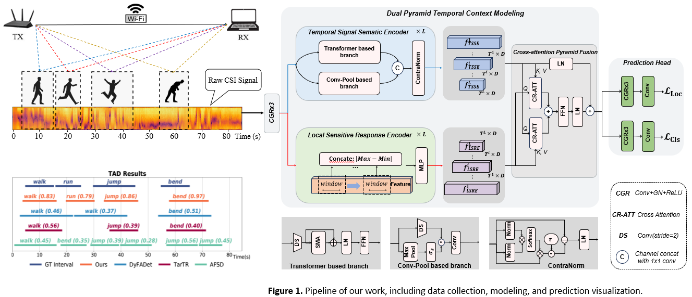
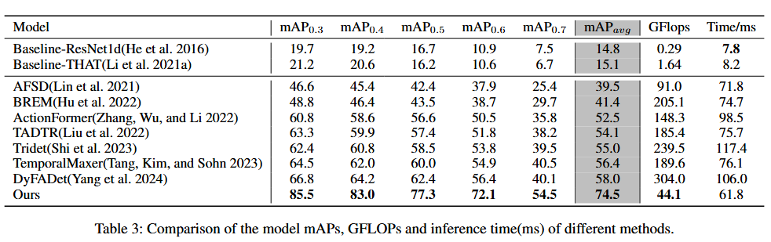

# [AAAI25] WiFi Temporal Activity Detection via Dual Pyramid Network
Authors: *Zhendong Liu, Le Zhang, Bing Li, Yingjie Zhou, Zhenghua Chen and Ce Zhu*

## Abstract
We address the challenge of WiFi-based temporal activity detection and  propose an efficient Dual Pyramid Network that integrates Temporal Signal Semantic Encoders and Local Sensitive Response Encoders. The Temporal Signal Semantic Encoder splits feature learning into high and low-frequency components, using a novel Signed Mask-Attention mechanism to emphasize important areas and downplay unimportant ones, with the features fused using ContraNorm. The Local Sensitive Response Encoder captures fluctuations without learning. These feature pyramids are then combined using a new cross-attention fusion mechanism. We also introduce a dataset with over 2,114 activity segments across 553 WiFi CSI samples, each lasting around 85 seconds. Extensive experiments show our method outperforms challenging baselines. [[paper](https://github.com/AVC2-UESTC/WiFiTAD/blob/main/mainPaper.pdf)] [[appendix](https://github.com/AVC2-UESTC/WiFiTAD/blob/main/Appendix.pdf)] 

 <p align="center">
 
 </p>

## Summary 
- First TAD framework for wireless human activity detection (localization), with an untrimmed WiFi CSI dataset.
- Powerful dual-pyramid encoders and multi-level cross-attention feature fusion.
- Easily extansible to other signal modalities.

## Performance



## Getting Started
### Dependencies & Installation
We recommend to use conda to manage your environment, and to install PyTorch 1.12.1:

```
conda create -n wifitad python=3.8
pip install torch==1.12.1+cu116 torchvision==0.13.1+cu116 torchaudio==0.12.1 --extra-index-url https://download.pytorch.org/whl/cu116
```

Other packages required to support this project can be installed by running:

```
pip install -r requirements.txt
```

build the project package manager: 

```
python3 setup.py develop
```

### Dataset Downloads
WiFi Temporal Activity Detection Dataset: We will release it soon!

### Training and Tnference Example
Run the traing and inference processes in terminal by: 

```
bash WiFiTAD/train_tools/tools.sh 0,1
```

### Notes
You may tune the hyperparameters of NMS to get wider range of TAD results.

## Citation & Acknowledgment
If you find the paper and its code uesful to your research, please use the following BibTex entry.

```
 @inproceedings{liu2024wificsibasedtemporal,
  title={WiFi CSI Based Temporal Activity Detection Via Dual Pyramid Network},
  author={Zhendong Liu, Le Zhang, Bing Li, Yingjie Zhou, Zhenghua Chen and Ce Zhu},
  booktitle={The 39th Annual AAAI Conference on Artificial Intelligence},
  volume={},
  number={},
  year={2025}
}
```

This code is built on AFSD and Actionformer. We greatly express our gratitude for their contributions.
