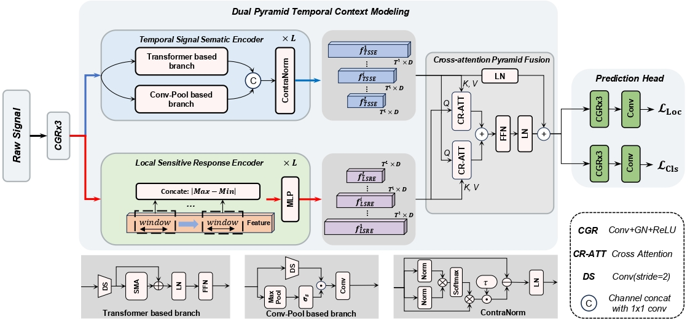

# WiFi Temporal Activity Detection via Dual Pyramid Network

Zhendong Liu, Le Zhang, Bing Li, Yingjie Zhou, Chengzheng Hua and Ce Zhu, "WiFi Temporal Activity Detection via Dual Pyramid Network", AAAI 2025

[[paper](https://openaccess.thecvf.com/content/ICCV2023/papers/Li_Feature_Modulation_Transformer_Cross-Refinement_of_Global_Representation_via_High-Frequency_Prior_ICCV_2023_paper.pdf)] [[pretrained models](https://drive.google.com/file/d/13wAmc93BPeBUBQ24zUZOuUpdBFG2aAY5/view?usp=sharing)]

---
**Abstract:** *We address the challenge of WiFi-based temporal activity detection and  propose an efficient Dual Pyramid Network that integrates Temporal Signal Semantic Encoders and Local Sensitive Response Encoders. The Temporal Signal Semantic Encoder splits feature learning into high and low-frequency components, using a novel Signed Mask-Attention mechanism to emphasize important areas and downplay unimportant ones, with the features fused using ContraNorm. The Local Sensitive Response Encoder captures fluctuations without learning. These feature pyramids are then combined using a new cross-attention fusion mechanism. We also introduce a dataset with over 2,114 activity segments across 553 WiFi CSI samples, each lasting around 85 seconds. Extensive experiments show our method outperforms challenging baselines.*

 

 
 

---

## Note
This is a preliminary version for early access and I will clean it for better readability.

### Dependencies & Installation
We recommend to install Python 3.8 and pytorch 1.12.1: 

`pip install torch==1.12.1+cu116 torchvision==0.13.1+cu116 torchaudio==0.12.1 --extra-index-url https://download.pytorch.org/whl/cu116`

Other packages required to support this project can be installed by running:

`pip install -r requirements.txt`

### Setup

build the project package manager: `python3 setup.py develop`

### Training and Tnference
Run the traing and inference processes in terminal by: `bash WiFiTAD/train_tools/tools.sh 0,1`

### Data Preparation
WiFi Temporal Activity Detection Dataset: [link]
<!-- (https://drive.google.com/file/d/1gy0ppFtypVTtgBfrFzdMJUbXTb1MbPSK/view?usp=drive_link) -->

## Citation

## Acknowledge

This code is built on AFSD, Actionformer, Tridet and Actionformer. We express our gratitude for their outstanding contributions!
